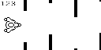
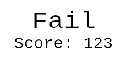

# Lab4_PVS

Видео: [https://youtu.be/IL8HvLYG53A](https://youtu.be/IL8HvLYG53A).

## Описание

Написать программу, реализующую простую игру «пройди ворота». С левой стороны
дисплея располагается «корабль» игрока, который может перемещаться верх и вниз (форма и
размеры корабля на усмотрение исполнителей). С правой стороны на него двигается
последовательность «ворот» – вертикальных стенок с отверстием в два раза больше корабля.
Отверстия располагаются на разном уровне, поэтому для прохождения ворот надо перемещать
корабль.

Игра запускается и останавливается по нажатию кнопки клавиатуры SDK-1.1M.
Управление кораблем вверх/вниз выполняется с помощью еще двух кнопок.
Последовательность должна содержать не менее 5 ворот. Если корабль врезается в стенку,
игра считается не пройденной. После завершения игры на дисплей выводится сообщение с
оценкой результата: «Success» или «Fail».

## Скетчи экранов игры

### Ожидание

### Игра

### Конец игры

